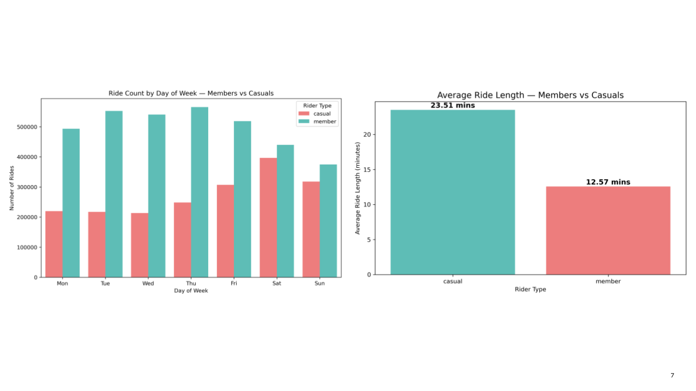
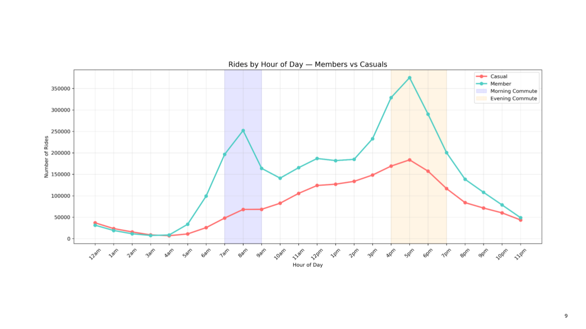

# Product Funnel Analysis for SaaS FinTech

## Executive Summary:

Cyclistic is a chicago based bike-share company, operating with a fleet of thousand of different type of bicycles.The company offers flexible service options through annual memberships and single ride passes.

1. Copy changes within the workflow
2. Reminder emails/texts
3. Better client relationships

## Business Problem: 

Cyclistic believes future growth lies maximizing the number of annual members. Rather than targeting new customers, the company aims to transform casual members (single-ride passes) to members (annual paid) will yield the most future growth.

## Methodology: 

### Skills

Excel: Data inspection,  

SQL: CTEs, Joins, Case, aggregate functions

Python: Pandas, Matplotlib, Numpy, 

### Data Preparation
1. Combined and validated trip-level datasets.
2. Removed unrealistic ride duration values.
3. Engineered features: Ride length, Day of week, Hour of day

### Segmentation

Riders were behaviorally segmented to distinguish:

1. Commuter-oriented riders

2. Leisure-focused riders

## Insights

### Members Ride for Commuting, Casuals Ride for Leisure

Annual members demonstrate strong weekday usage, indicating commuter behavior.

Casual riders exhibit higher weekend concentration and seasonal spikes.

Casual riders have longer average ride durations, consistent with leisure usage.

### Members Follow a Classic Commuter Pattern

A subset of casual riders shows repeat ride frequency patterns that align with membership value economics.

These differences suggest clear behavioral segmentation and defined conversion targets.

## Recommendation

Based on behavioral insights, the highest-impact growth opportunities include:

Targeting high-frequency casual riders with personalized membership incentives.

Deploying seasonal campaigns during peak leisure months.

Positioning membership messaging around cost savings for repeat weekday riders.

Testing limited-time membership trials to reduce conversion friction.

By focusing on high-potential segments rather than broad marketing efforts, Cyclistic can increase annual membership adoption while optimizing acquisition efficiency..

### Next Steps: 

1. AB Test copy within the workflow
2. Train clients and users
3. Measure email and text open & click rates
