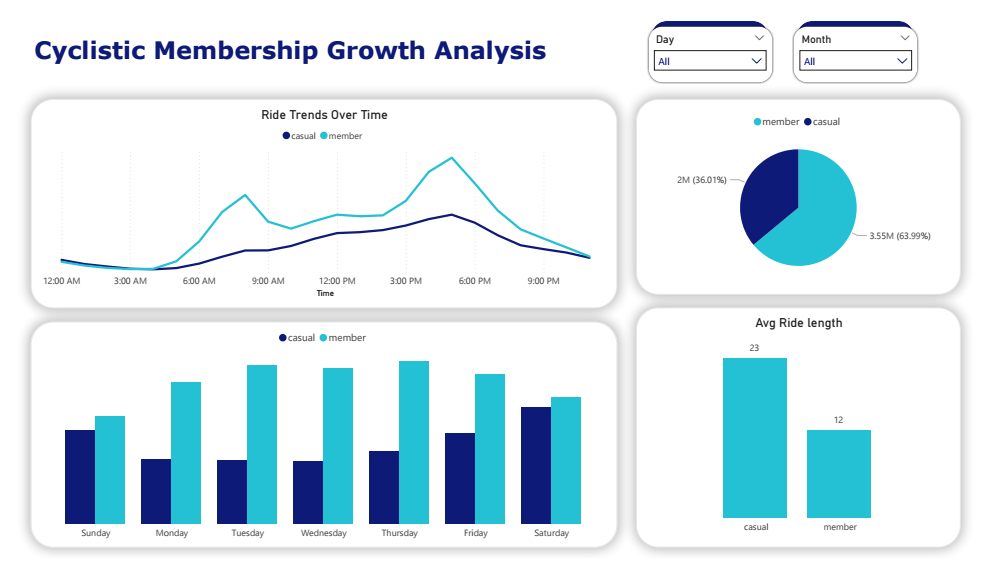
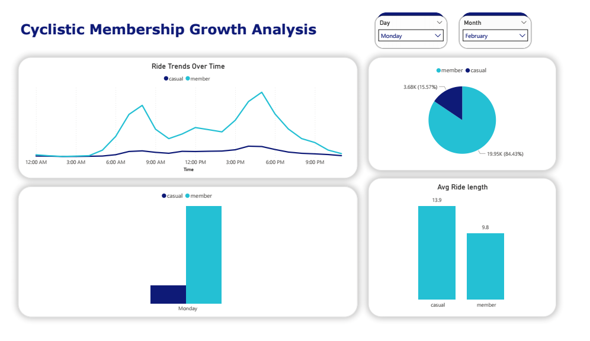
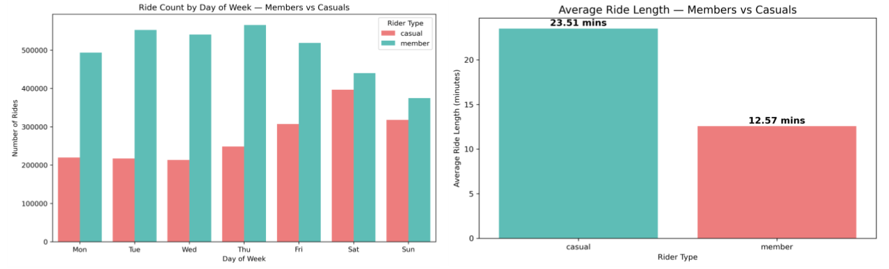
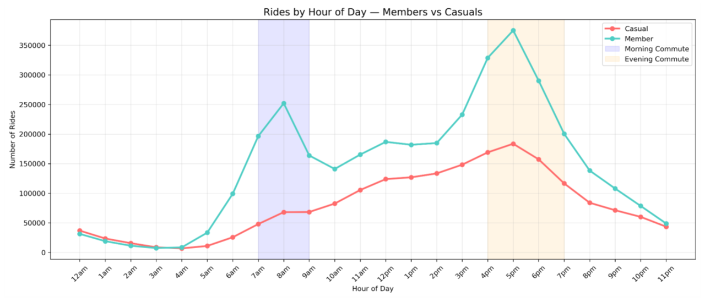
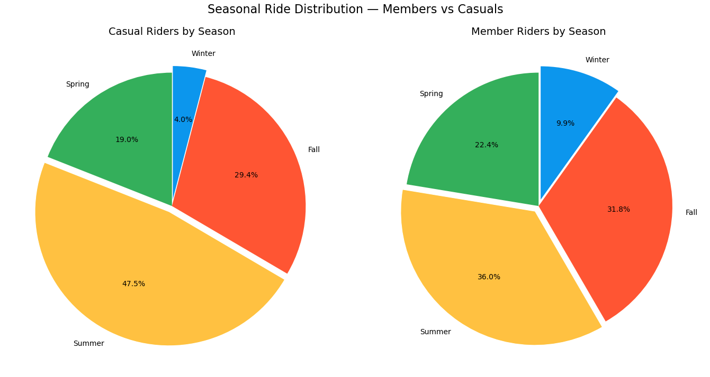
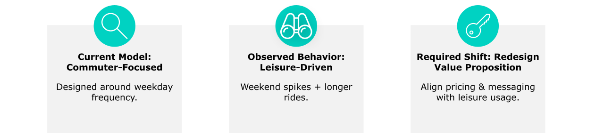

# Customer Segmentation & Membership Conversion Analysis

**Bike-share customer behavior analysis across 5.5M trip records to identify membership conversion opportunities.**

---

## Executive Summary

A Chicago-based bike-share operator's long-term growth strategy focuses on converting casual riders into annual members rather than broad acquisition. This project analyzes **5.5M trip records** across two customer segments to uncover behavioral differences and pinpoint the highest-ROI conversion opportunities.

**Key Findings:**
- Casual riders average **23.5-minute trips** vs. **12.6 minutes** for members — an **87% gap** signaling fundamentally different use cases (leisure vs. commuting)
- Casual ride volume swings **~14x** between January and August vs. **~4x** for members — late spring through summer is the highest-ROI window
- High-frequency weekday casual riders show usage patterns that already resemble annual members, making them the clearest conversion targets

**Recommendation:** Target high-frequency weekday casual riders with limited-time trial memberships during the spring–summer window to reduce conversion friction and maximize marketing efficiency.

---

## 📊 Dashboard Preview

An interactive Power BI dashboard built to explore behavioral differences between annual members and casual riders across time, weekday, and ride duration.

**Filters:** Day and Month slicers enable dynamic exploration of rider patterns.

**Visuals include:**
- **Ride Trends Over Time** — hourly ride volume comparing members vs. casuals
- **Rides by Day of Week** — weekday vs. weekend usage breakdown
- **Member vs. Casual Split** — overall ride share
- **Avg Ride Length** — side-by-side comparison of average duration by rider type

### Overview (All Data)

### Filtered View (Example: Monday in February)

> 🔍 Filtering to **Monday, February** reveals members dominate weekday rides, while casuals show significantly longer average ride lengths (13.9 vs 9.8 min).

---

## Business Problem

Future growth depends on maximizing annual memberships. Rather than acquiring new customers broadly, the company aims to convert existing casual riders into annual members.

**Core question:** *How can the business identify and target casual riders whose behavior aligns with the value of annual membership?*

Understanding behavioral differences between rider segments is essential for designing effective, cost-efficient conversion strategies.

---

## Dataset

Public trip data provided by Motivate International Inc. via the City of Chicago — ride-level records including start/end times, station info, and rider type.

[Download the data here](https://divvy-tripdata.s3.amazonaws.com/index.html)

---

## Methodology

### Tools & Skills

| Tool | Use |
|------|-----|
| **Excel** | Data inspection, pivot analysis, validation checks |
| **SQL (BigQuery)** | Aggregations, segmentation, exploratory analysis by rider type, weekday, and month |
| **Python (Pandas, Seaborn, Matplotlib)** | Data cleaning, feature engineering, behavioral analysis, visualization |
| **Power BI** | Interactive dashboard for stakeholder exploration |

### Data Preparation
1. Combined and validated trip-level datasets
2. Removed unrealistic or invalid ride duration values
3. Engineered analytical features: ride length, day of week, hour of day

### Segmentation
Riders were behaviorally segmented into two primary groups:
- **Commuter-oriented riders** — weekday ride concentration, commute-hour usage patterns
- **Leisure-focused riders** — weekend-heavy usage, longer average ride durations

This segmentation framework identified riders with the highest conversion potential.

---

## Insights

### 1. Members Ride for Commuting, Casuals Ride for Leisure

Annual members show strong weekday usage consistent with commuter behavior. Casual riders show increased weekend concentration and seasonal spikes, indicating leisure-oriented usage.

Casual riders average **23.5-minute trips** vs. **12.6 minutes** for members — an **87% gap** reinforcing the fundamental behavioral distinction between the two segments.

### 2. Members Follow a Classic Commuter Pattern

Members show **two sharp peaks** — a morning spike at 8 AM (~250K rides) and a dominant evening peak at 5 PM (~375K rides) — a textbook commute signature tied to the work day.

Casual riders show **no commute behavior at all** — just a slow, gradual build from morning through a flat afternoon peak (~180K rides at 5 PM), more consistent with errands, tourism, and leisure rides.

**Implication:** these aren't two versions of the same customer — they're two fundamentally different use cases. Conversion strategy cannot assume one-size-fits-all messaging.

### 3. Seasonality Exposure is Dramatically Different

Casuals concentrate **47.5% of their rides in summer** and just **4% in winter** — a massive seasonal swing. Members are far more balanced, spreading rides across all four seasons (**36% summer, 9.9% winter**).

This translates to a **~14x** casual volume swing between January and August vs. **~4x** for members — pinpointing **late spring through summer** as the highest-ROI window for conversion campaigns, when the pool of casual riders is largest and most engaged.

### 4. Growth Requires Redesigning Membership Around Leisure Usage

The current membership product is **commuter-focused** — designed around weekday frequency. But the observed behavior of casual riders is **leisure-driven** — weekend spikes and longer rides.

Closing this gap requires a **redesigned value proposition**: aligning pricing, messaging, and membership structure with leisure usage patterns rather than forcing casual riders into a product built for commuters.

---

## Recommendations

The highest-impact growth opportunities include:

- **Target high-frequency weekday casual riders** with personalized membership offers — their behavior already resembles members
- **Launch seasonal campaigns during late spring and summer** to capture peak leisure-driven demand, the period with maximum conversion surface area
- **Position membership value around cost savings** for riders with recurring usage patterns
- **Introduce limited-time trial memberships** to reduce conversion friction among frequent casual users

Focusing on **behavior-based targeting rather than broad acquisition** will improve conversion efficiency and increase membership adoption.

---

## Next Steps

- Define high-frequency casual rider criteria based on ride count, duration, and weekday usage patterns
- Track rider cohorts over time to identify consistent usage behavior and conversion readiness
- A/B test targeted membership offers on identified segments and measure conversion rates
- Monitor campaign performance and refine targeting strategy based on observed behavior

---

*Author: Mohammed Alzahrani | [LinkedIn](https://linkedin.com/in/mohammedalz-)*
